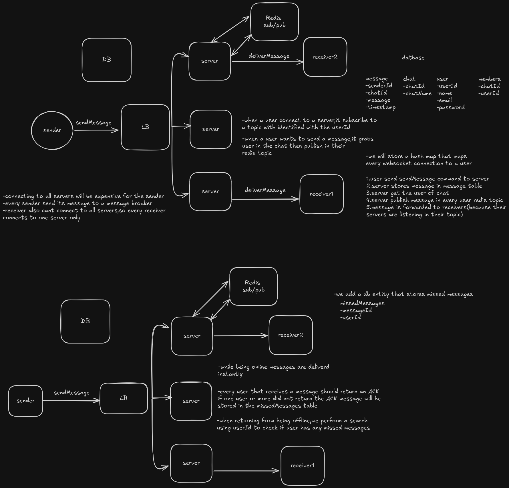

# Chat application

## Functional requirements
- Users should be able to start chats
- Users should be able to send messages
- Users should be able to receive messages(whether they are online when messages are sent or offline)

## Non functional requirements
- low latency(~500ms)
- high availabilty
- scalining

## api

In this application we will use websockets to connect users and servers and as a result we wont have regular endpoints.

### Commands

- sendMessage

{
    "type": "sendMessage",
    "chatId": "",
    "message": "",
} -> {
    "SUCCESS" | " FAILURE",
     "message"Id": "",
}

- receiveMessage

{
    "type": "receiveMessage",
    "chatId": "",
    "messageId": "",
    "UserId": "",

}
- createChat

{
    "chatName": "",
    "participants": [],
} -> {
    "chatId": "",
}

## High level design

- We will use DynamoDB for chat application because of its fast retrivals and scalability. our essential need is lots of write and lots of simple lookups with no joins or complex queries

## Deep dives

- Redis pub/sub is a solution for scaling our system(and espacially chat servers).When adding chat servers a routing probleme arise because users(from same chat) will be spread across multiple servers which make delevring messages harder.Redis pub/sub is a simple map between users and servers , which is way lighter than kafka who is not built for this type of missions.