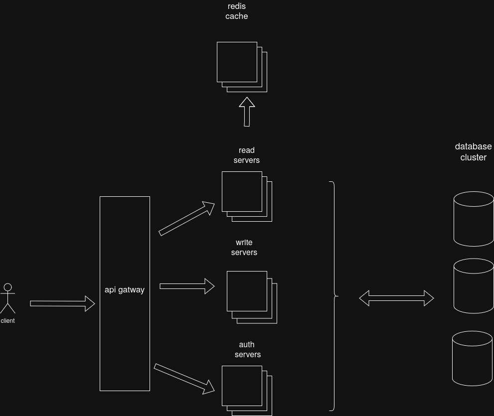

# THIS design is abondend because it is wrong
# chat_application

This chat application will be a discord like app

## Functional Requirements
- Users should be able to create accounts
- Users should be able to join chats
- Users should be able to send messages
- Users should be able to read messages even after being offline
## Non-functional Requirements

- High availabilty
- Messages should be in order
- Low latency (fast writes and reads)(500ms)
- scaleability (stores a lot of messages, and handles big volume of sent messages)

## Core entities

- User
- chat_room
- message

## Api end-points

### - get latest 100 message
GET /chat/{id}

Inputs:
    chat id
    auth token

Ouput:

{
    "message1": "lorem",
    "message1 sender": "el bo3",
    .
    .
    .
    "message100": "lorem"
    "message100 sender": "7amouda",
}

### - join chat
POST /chat/{id}/join

Inputs:
    chat id
    auth token

OUTPUT:
    http response

### - send message
POST /chat/{id}

Inputs:
    chat id
    user id
    message body

OUTPUT:
    http response

### - create account
POST /sign-in

OUTPUT:
    http response

### - sign up
POST /sign-up

OUTPUT:
    http response

## High level desing

-

## Deep dives

- Each main functionnality will run on its own servers in order to scale services when needed and increase availabilty.An api gateway will sit in front of this servers to route requests
- The chat applications is a heavy read application but with a significant amount of writes, so we need a high read throughput and high writes throuput thats why a leaderless replication database is more appropriate in this situation
- Message distribution:We will use consistent hashing for storing a chat messages.Every chat will have a unique id,messages of that chat will have a generated id from the chat id and every id will have a privatie partition reserved for him.  we have potentiel problemes in creating a hot spots for very active servers.While 90% of discord servers have less than 15 members we can handle this probleme.
- For auth service no need for the high throughput provided by leaderless replication so single leader replication or multi leader replication will be more appropriate 
- Message should be sent continously to users,they dont have to send a request in order to get messages.That s why we need a mechanism like long polling or web sockets to get this requirement